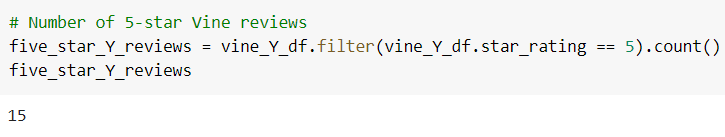

# Amazon_Vine_Analysis
Module 16

## Overview
Analysis of Amazon reviews written by members of the paid Amazon Vine program to determine if there is any bias toward favorable reviews from Vine members in the dataset.

### Results - Analysis of Apparel Dataset

- Vine Reviews 

     

 

- Non-Vine Reviews 

     

 

- Vine 5-Star Reviews 

     

 
